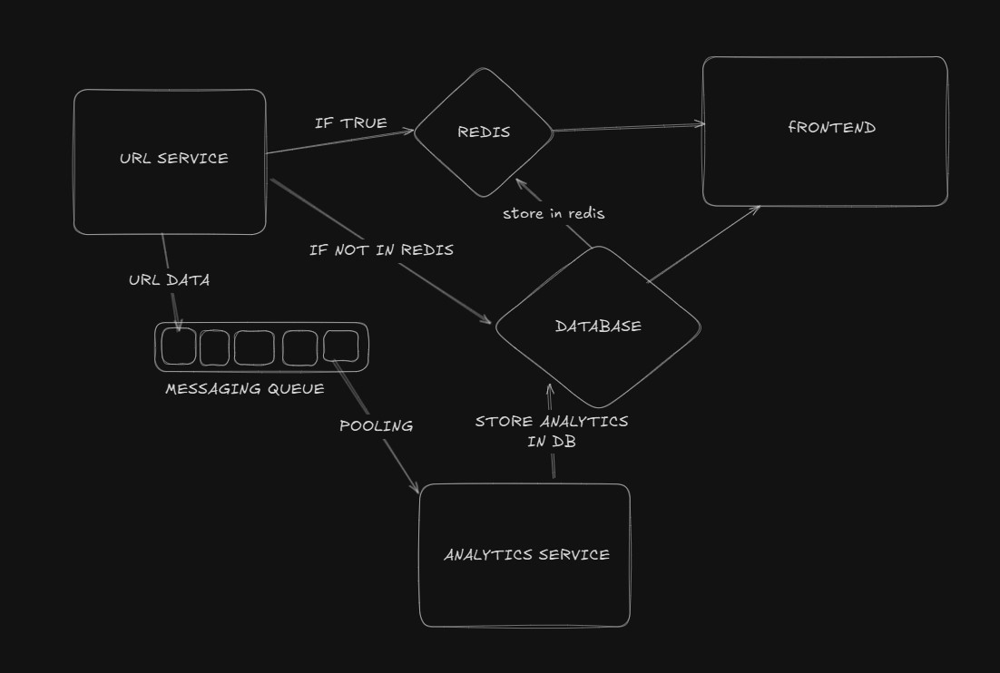

# 🚀ScaleURL — URL Shortener

This repository contains a microservices-based URL shortener with analytics. It is split into multiple services:

- backend/url-service — primary service that creates short URLs, serves redirects, caches redirects in Redis, and enqueues visit events.
- backend/analytics-service — background worker that consumes visit events from Redis and updates analytics in MongoDB.
- frontend — React single-page app with URL creation UI and analytics dashboard (Recharts).

This README explains how the system works, how to run it locally, deployment and scaling recommendations, and backend optimizations used.

---

## 🧠Architecture Diagram

## Contents

- How it works (request flow)
- Local development (Docker + npm)
- Environment variables
- Architecture & scalability
- Backend optimizations and tuning
- Operational guidance (monitoring, alerts)
- Next steps

---

## How it works (request flow)

1. Create short URL: client → `url-service` POST `/api/v1/url/shorten`. The service validates the URL, stores a record in MongoDB, and caches the mapping in Redis.
2. Redirect: client → `url-service` GET `/:shortCode`.
   - `url-service` first checks Redis for the original URL. If present, it responds immediately with a 302 redirect.
   - If cache miss, `url-service` reads MongoDB, caches the URL in Redis with a TTL, pushes a visit event to Redis `visitQueue`, and redirects.
3. Analytics: `analytics-service` runs a background loop (BLPOP) on `visitQueue` and processes visit events, atomically incrementing visit counters in MongoDB (or performing batch updates).

This separation ensures redirects are low-latency while analytics processing is handled asynchronously.

---

## Architecture & Scalability

High-level components:

- Load Balancer / API Gateway
- url-service (stateless) × N instances
- analytics-service (consumer) × M instances
- Redis cluster (caching + queue)
- MongoDB replica set (primary + secondaries), optional sharding

Scaling guidance:
- Make `url-service` stateless so you can horizontally scale behind a load balancer.
- Use Redis Cluster (or managed Redis) to avoid single-node limits for caching and queueing.
- For analytics throughput > tens of thousands/sec, shard the events/visit data in MongoDB and use partitioned consumers.
- Autoscale services based on request rate, CPU, and Redis queue length.

Data flow considerations:
- Keep redirects synchronous and as simple as possible: Redis lookup → 302.
- Use Redis lists or streams to decouple analytics processing; streams (Redis Streams) give reliability and consumer groups if needed.
- For strict delivery guarantees and replayability, consider Kafka or Redis Streams instead of a plain list.

---

## Backend optimizations & best practices

Caching & latency
- Store shortCode → originalUrl in Redis with a TTL. This eliminates Mongo reads for most redirects.
- Warm caches when new short links are created.

Asynchronous processing
- Use Redis BLPOP (or Streams + consumer groups) to push visit events; the analytics worker updates DB asynchronously.
- Batch updates (bulkWrite) in the analytics worker to amortize DB write cost.

Database
- Index `shortCode` with a unique constraint to allow efficient lookups.
- For analytics aggregates, keep a separate collection with counters and use atomic $inc operations.
- Consider TTL indexes or aggregated rollups for long-term analytics storage to reduce storage costs.

Rate limiting & abuse prevention
- Implement rate limiting per short link using Redis INCR + EXPIRE (sliding windows or fixed windows depending on requirements).
- Fail-open strategy may be used for rate limiter if Redis fails, while alerting operators.

Resilience
- Use retries with exponential backoff for transient Redis/Mongo errors.
- Configure graceful shutdown and in-flight request draining on service stop.

Observability
- Emit metrics: redirect latency, cache hit ratio, queue length, processing lag, error rates.
- Use distributed tracing (OpenTelemetry) to trace a request through services.

---

## Operational guidance

Monitoring & Alerts
- Alert on Redis memory pressure, eviction, queue length, and latency.
- Alert on MongoDB replication lag and primary election events.
- Alert on high 5xx rate or rising redirect latency.

Backups & data retention
- Ensure MongoDB backups for critical data. For high-cardinality analytics, implement rollups and prune raw events.

Security
- Validate and sanitize input URLs; block SSRF by restricting redirect targets or performing allowlist checks.
- Rate limit creation and redirects to limit abuse.
- Use TLS for public endpoints and secure Redis/Mongo with authentication.

---

## Next steps & improvements

- Replace Redis LIST with Redis Streams or Kafka for reliable event streaming and consumer groups.
- Add a dedicated analytics read-model optimized for dashboard queries (pre-aggregations).
- Implement A/B testing and feature flags for new redirect behaviors.
- Add e2e tests and CI pipelines for deployments.

---

